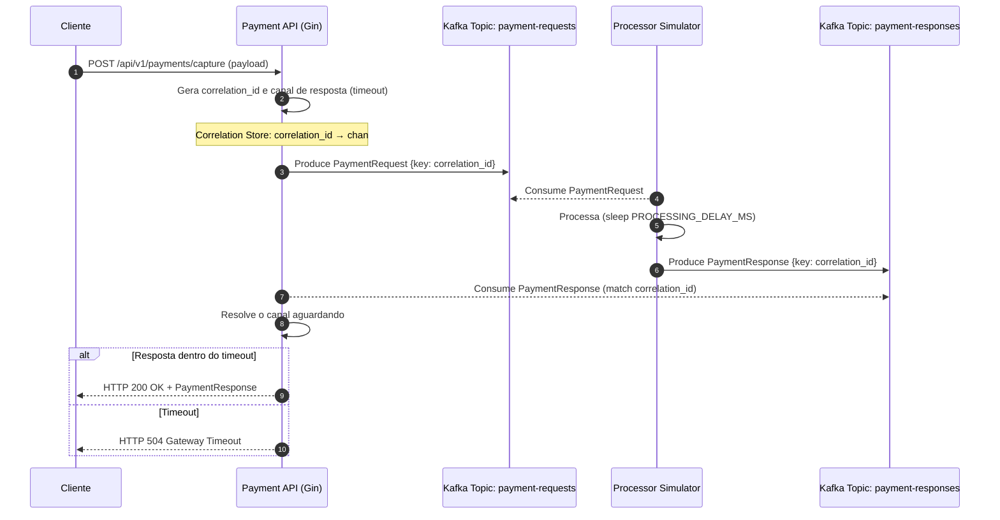

# DemoSync

DemoSync é uma prova de conceito (PoC) que demonstra como implementar uma API de pagamentos com interface síncrona para o cliente, enquanto realiza o processamento de forma assíncrona internamente usando Kafka.

## O Problema

Em sistemas de pagamento, muitas vezes nos deparamos com o seguinte cenário:

- Clientes precisam de respostas síncronas para suas solicitações de captura de pagamento
- Internamente, o processamento real é realizado de forma assíncrona
- As respostas chegam via mensageria (Kafka) após o processamento

Este projeto demonstra como resolver esse problema implementando um padrão de **request-response correlacionado** com Kafka.

## Arquitetura



A solução é composta por:

1. **API HTTP**: Interface REST que recebe solicitações de captura de pagamento  
2. **Armazenamento de Correlação**: Mapeia IDs de correlação para canais de resposta  
3. **Produtor Kafka**: Publica solicitações no tópico de requisições  
4. **Consumidor Kafka**: Escuta respostas no tópico de respostas  
5. **Simulador de Processador**: Simula um sistema externo que processa as solicitações  

## Tecnologias

- Go 1.25
- Confluent Kafka
- Docker e Docker Compose
- Gin Web Framework

## Estrutura do Projeto

```text
demosync/
├── cmd/
│   ├── api/               # Aplicação principal da API
│   │   └── main.go
│   └── simulator/         # Simulador de processamento de pagamento
│       └── main.go
├── internal/
│   ├── api/               # Servidor HTTP e handlers
│   │   ├── handlers/
│   │   │   └── capture.go # Handler de captura de pagamento
│   │   └── server.go      # Configuração do servidor HTTP
│   ├── kafka/             # Integração com Kafka
│   │   ├── consumer.go    # Consumidor de mensagens Kafka
│   │   └── producer.go    # Produtor de mensagens Kafka
│   └── storage/           # Armazenamento de correlação
│       └── correlation.go # Armazenamento para correlacionar solicitações e respostas
├── pkg/
│   └── models/            # Modelos de dados compartilhados
│       └── payment.go     # Modelos de solicitação e resposta de pagamento
├── scripts/               # Scripts utilitários
│   ├── run_local.sh       # Script para executar localmente
│   └── test-api.sh        # Script para testar a API
├── docker-compose.yml     # Configuração do ambiente Docker
├── Dockerfile             # Dockerfile para a API
├── Dockerfile.simulator   # Dockerfile para o simulador
├── go.mod                 # Dependências do Go
└── README.md              # Este arquivo
```

## Como Funciona

1. O cliente envia uma solicitação HTTP POST para `/api/v1/payments/capture`  
2. A API gera um ID de correlação único  
3. A API cria um canal para receber a resposta futura  
4. A API publica a solicitação no tópico Kafka com o ID de correlação como chave  
5. A API aguarda a resposta no canal (com timeout)  
6. O simulador de processamento consome a solicitação  
7. O simulador processa a solicitação (simulando o tempo de processamento)  
8. O simulador publica a resposta no tópico Kafka com o mesmo ID de correlação  
9. O consumidor da API recebe a resposta e a envia para o canal correto  
10. A API HTTP retorna a resposta para o cliente  

## Começando

### Pré-requisitos

- Docker e Docker Compose
- Go 1.25 (para desenvolvimento local)
- Git

### Executando o Projeto

1. Clone o repositório:
   ```bash
   git clone https://github.com/seu-usuario/demosync.git
   cd demosync
   ```

2. Inicie os contêineres Docker:
   ```bash
   docker-compose up -d
   ```

3. Teste a API:
   ```bash
   ./scripts/test-api.sh
   ```

### Desenvolvimento Local

Para executar a aplicação localmente (fora do Docker):

```bash
./scripts/run_local.sh
```

Isso iniciará a API localmente, conectando-se ao Kafka que está rodando no Docker. O script configura automaticamente as variáveis de ambiente adequadas para o ambiente de desenvolvimento.

## Fluxo de Dados

### Requisição de Captura

```json
{
  "transaction_id": "tx_123456",
  "amount": 100.50,
  "currency": "BRL",
  "metadata": {
    "order_id": "order_12345",
    "customer_id": "cust_6789"
  }
}
```

### Resposta de Captura (Sucesso)

```json
{
  "correlation_id": "550e8400-e29b-41d4-a716-446655440000",
  "transaction_id": "tx_123456",
  "status": "approved",
  "authorization_code": "123456"
}
```

### Resposta de Captura (Falha)

```json
{
  "correlation_id": "550e8400-e29b-41d4-a716-446655440000",
  "transaction_id": "tx_123456",
  "status": "declined",
  "error_code": "payment_declined",
  "error_message": "Pagamento recusado pela operadora"
}
```

## Simulação do Processador

O simulador de processamento imita um sistema externo que:

- Consome solicitações do tópico de requisições  
- Processa as solicitações (com atraso simulado)  
- Responde com aprovações (80% das vezes) ou recusas (20% das vezes)  
- Publica as respostas no tópico de respostas  

Para alterar o tempo de processamento simulado, ajuste a variável de ambiente `PROCESSING_DELAY_MS` no serviço `payment-processor-simulator` no arquivo `docker-compose.yml`.

## Depuração

Se você precisar verificar os tópicos Kafka, pode usar os seguintes comandos:

```bash
# Listar tópicos
docker exec -it kafka kafka-topics --bootstrap-server localhost:9092 --list

# Consumir mensagens do tópico de requisições
docker exec -it kafka kafka-console-consumer --bootstrap-server localhost:9092 --topic payment-requests --from-beginning

# Consumir mensagens do tópico de respostas
docker exec -it kafka kafka-console-consumer --bootstrap-server localhost:9092 --topic payment-responses --from-beginning
```

## Considerações de Produção

Esta é uma prova de conceito e não está pronta para produção. Para um ambiente de produção, considere:

1. Implementar mecanismos de retentativa  
2. Adicionar autenticação e autorização  
3. Implementar validação robusta  
4. Adicionar monitoramento e alertas  
5. Configurar Kafka com replicação adequada  
6. Gerenciar o ciclo de vida das mensagens e estados no Kafka  
7. Implementar um sistema de fallback para casos de indisponibilidade
